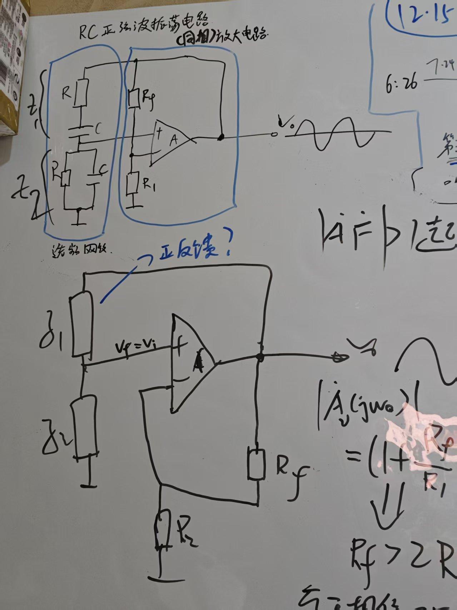

## 迟滞比较器

指路[\[迟滞比较器\]](https://www.bilibili.com/video/BV1kz421i7E8/?spm_id_from=333.337.search-card.all.click\&vd_source=8f5133da4f1c5c493f983acf35471cfd)

有意思的是，RC正弦波振荡电路，把串并联RC网络看成两个阻抗Z1Z2，会发现组态和反相迟滞比较器的结构非常相似。 

门限：这里由于信号直接从反相端输入，所以门限就是up，关于门限的解释是：因为同相端的电压up是**参考电压Vref**，所以当输入电压超过Vref时，输出就会从0跳转到1,当输入电压低于Vref时，输出就会从1跳转到0。
